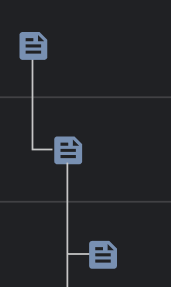

# Budget Table

> Table of construction and erection work for budget app.


---

[Description](#description) •
[Project setup](#project-setup) •
[Features](#features) •
[How To Use](#how-to-use) •
[Project Status](#project-status) •
[Room for Improvement](#room-for-improvement) •
[License](#license) •
[Contact](#contact)

![Screenshot][screenshot]

## Description
The application was created on the basis of one of the test tasks.

## Project setup

- Clone this repo to your desktop and run ```yarn``` or ```npm install``` to install all the dependencies.
- Once the dependencies are installed, you can run ```yarn dev``` or ```npm dev``` to start the application.
- After that, you can access it at the address specified in the terminal.

## Features
- Add child rows when clicking on the document icon.
- Changing values in a row. Is activated by using the enter keys on the row.
- Remove rows when clicking on the trash icon. 
- If there are no rows in the database, it is suggested to create a new one.

## How To Use

Run [Live Demo](https://table-of-construction-and-erection-work.vercel.app/)

> [The server part of the application](https://github.com/RimidalU/budget-table_server) is on a free server, so it takes time to start (usually 5-10 seconds). After starting the server, update the application to get the data from bd.

![Tutorial][tutorial]

## Project Status

Project is: *in slow intermittent progress*

## Room for Improvement

To do:

- Add a graphical display of nested rows -> 


## License

This project is open source and available under the [MIT]().

## Contact
Created by [@RimidalU](https://www.linkedin.com/in/uladzimir-stankevich/) - feel free to contact me!

<p align="right"><a href="#start"></a></p>

<!-- MARKDOWN LINKS & IMAGES -->
[tutorial]: ./readmeassets/tutorial.webp
[screenshot]: ./readmeassets/page.png
